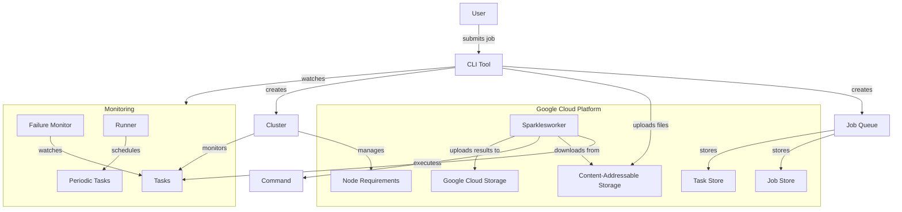

# Sparklespray Architecture

## Component Descriptions

### Core Components
- **CLI Tool**: User interface for submitting and managing jobs
- **Job Queue**: Manages jobs and their associated tasks
- **Cluster**: Manages the compute resources for executing tasks
- **Worker (Sparklesworker)**: Executes tasks on compute nodes

### Storage Components
- **Job Store**: Stores job metadata
- **Task Store**: Stores task metadata and status
- **Content-Addressable Storage (CAS)**: Stores input files with content-based addressing
- **Google Cloud Storage (GCS)**: Stores output files and results

### Monitoring Components
- **Runner**: Schedules and runs periodic monitoring tasks
- **Failure Monitor**: Monitors for task failures and node issues

### Data Models
- **JobSpec**: Defines a job and its tasks
- **Task**: Individual unit of work with downloads, command, and uploads
- **NodeReq**: Compute node requirements for task execution
- **MachineSpec**: Defines machine configuration for workers

## Workflow
1. User submits a job via CLI
2. Files are uploaded to CAS with content-based addressing
3. Job and tasks are created in storage
4. Cluster provisions compute resources
5. Workers claim and execute tasks
6. Results are uploaded to GCS
7. Monitoring components track progress and handle failures
