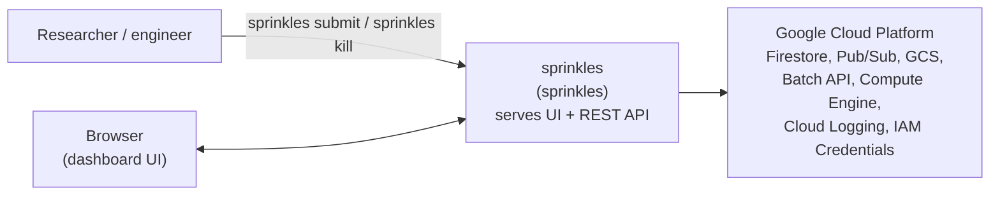

# 3. Context and Scope

## 3.1 Business Context

External actors / systems:

| Actor                      | Interaction                                                                                                                                                                                                                                 |
| -------------------------- | ------------------------------------------------------------------------------------------------------------------------------------------------------------------------------------------------------------------------------------------- |
| **End user**               | Runs `sprinkles submit` / `sprinkles kill` CLI; authenticates to the dashboard-backend via `SPRINKLES_API_KEY`.                                                                                                                             |
| **Browser (dashboard UI)** | Loads the dashboard UI and calls its REST API (`openapi.yaml`) for job/task/workpool/worker status and log streaming, both served by the dashboard-backend (`sprinkles serve`) itself — see [Deployment View](07-deployment-view.md), §7.2. |
| **GCP Batch API**          | Creates/monitors VM "jobs" that run the worker binary.                                                                                                                                                                                      |
| **GCP Compute Engine API** | Lists/terminates individual worker VMs during anomaly handling.                                                                                                                                                                             |
| **Cloud Firestore**        | System of record for all application state.                                                                                                                                                                                                 |
| **Cloud Pub/Sub**          | Event bus for lifecycle events, worker control messages, and Batch API notifications.                                                                                                                                                       |
| **Cloud Storage (GCS)**    | Task input/output file transfer; hosts the worker binary for VM bootstrap.                                                                                                                                                                  |
| **Cloud Logging**          | Batch job logs (`LogsPolicy: CLOUD_LOGGING`).                                                                                                                                                                                               |
| **IAM Credentials API**    | Mints short-lived tokens for a Pub/Sub "subscriber" service account used by the dashboard-backend's browser-facing subscription endpoint.                                                                                                   |

## 3.2 Technical Context

All roles are built from the same `sprinkles` binary. In deployment the
monitor and dashboard-backend are one process (`sprinkles serve`); they're
listed separately here because they're distinct roles with distinct
dependencies, and can be run apart via `sprinkles dev monitor` /
`sprinkles dev dashboard-backend`:

| Process                                                        | Started by             | Talks to                                                                                                                                                                                                                                 |
| -------------------------------------------------------------- | ---------------------- | ---------------------------------------------------------------------------------------------------------------------------------------------------------------------------------------------------------------------------------------- |
| **CLI client** (`submit`, `kill`)                              | End user, ad hoc       | Dashboard-backend HTTP API (`submit`); Firestore + Pub/Sub directly (`kill`)                                                                                                                                                             |
| **Worker** (`worker`)                                          | GCP Batch, one per VM  | Firestore (claim/update tasks, register itself), GCS (file transfer), Pub/Sub (`sprinkles-events` publish, per-worker control subscription), Docker daemon on the VM host, Compute metadata server                                       |
| **Monitor** (in `serve`, or `dev monitor`)                     | Operator, long-running | Firestore (all collections), Pub/Sub (`sprinkles-events`, `batch-api-notifications` subscribe), GCP Batch API, Compute Engine API, Cloud Logging API                                                                                     |
| **Dashboard-backend** (in `serve`, or `dev dashboard-backend`) | Operator, long-running | Firestore (read/write Jobs/Tasks on submit), Pub/Sub (publish `job_created`, browser-facing subscription helper), IAM Credentials API; also serves the embedded dashboard UI (static assets + SPA) directly to browsers on the same port |

Scope of this documentation: the `cli/` Go module. The `dashboard/`
frontend's _source_ (a separate Node/npm project) is out of scope as a
codebase, but its _build output_ is embedded into the `sprinkles` binary at
build time (`cli/build.sh` → `cli/dev/webui`) and served by
`dashboard-backend`, so at runtime there is no separate frontend
deployment to treat as an external system. `cli/` is the only active
implementation in the repository — the Python CLI it replaced has been
deleted, not merely deprecated.
