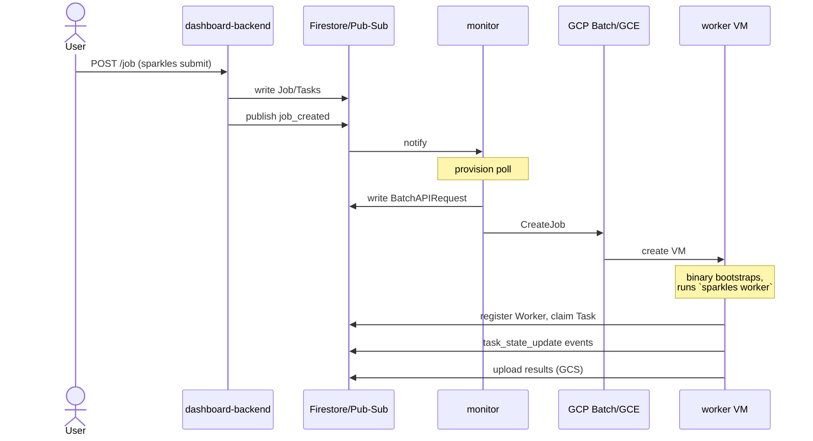

# 6. Runtime View

## 6.1 Job submission and execution (happy path)

1. User runs `sparkles submit job.json --params tasks.csv` (`submit_cmd.go`).
   If the job has a Mustache `task_template`, it's expanded once per CSV
   row into concrete per-task entries.
2. The CLI POSTs the job to the dashboard-backend
   (`POST /api/v1/job`, bearer-token auth via `SPARKLES_API_KEY`).
3. `dev/dashboard_backend.go` (`handleSubmitJob`) writes `Jobs`, `Tasks`,
   and an initial `JobSummary` document to Firestore, publishes a
   `job_created` event to `sparkles-events` (mirrored into `Events`), and
   — per the "influence via events" rule — this flips an `idle`/`halted`
   workpool back toward `ok` on the next summary poll.
4. **Provisioning** (`monitor/provision.go`, on its next poll or on the
   `job_created` notification): compares pending-task count to active
   worker count for the workpool, creates one or more `BatchAPIRequest`s
   (preemptible first, subject to `MaxPreemptibleWorkerAttempts`), and
   calls the GCP Batch API to create the underlying VM job.
5. GCP Batch provisions a VM. Its first runnable pulls the `sparkles`
   binary from GCS (`SparklesWorkerGCSPath`) via a throwaway
   `cloud-sdk:slim` container; its second runnable `chmod +x`s it and execs
   `sparkles worker ...` directly on the VM host.
6. The **worker** (`worker.go`) registers a `Workers` document, starts a
   1-minute heartbeat goroutine, then loops:
   - find a job with pending tasks in its workpool,
   - verify it has enough advertised `Resources` capacity for the task,
   - **claim** a task — `FirestoreTaskQueue.ClaimTask` fetches up to 100
     pending candidates for the job, shuffles them, and runs a Firestore
     transaction per candidate to atomically flip one `pending → claimed`,
   - **stage** — download `files_to_localize` from GCS,
   - **run** — `docker run` the task's command (or direct `exec.Command`
     under `--no-docker`, test-only),
   - **collect** — resource usage from cgroup files + `docker inspect`,
   - **report** — upload result/log files to GCS, mark the task
     `success` / `error` (non-zero exit) / `failed` (infra error).
   - Every transition publishes a `task_state_update` event.
7. **Summary polls** (`workpool_summary_poll.go`, `job_summary_poll.go`)
   recompute `WorkPoolSummary`/`JobSummary` rollups from fresh Firestore
   counts each run, which the dashboard reads.

## 6.2 Kill

`sparkles kill <job-id>` (`kill.go`) marks all pending/running `Tasks` for
the job as `killed` directly in Firestore, then best-effort broadcasts a
`kill_job` message on each active worker's per-worker Pub/Sub subscription
(`sparkles-worker-in-<worker_id>`) so any worker currently executing a task
for that job aborts it promptly (`--no-wait` skips waiting for
confirmation).

## 6.3 Failure recovery scenarios

- **Preemption** — the worker VM disappears; its heartbeat lapses; the
  requeue-orphaned poll (every 30s) resets its claimed task back to
  `pending` and marks the `Worker` `zombie`; provisioning replaces the VM
  on its next poll. This is treated as a _normal_, expected event, not an
  incident.
- **VM/Batch startup failure** — `batch_startup_monitor.go` detects a
  `pending` batch that GCP reports as failed, succeeded-with-no-workers,
  or stuck in queue, and marks it `failed`; this counts toward the halt
  threshold (§6.4).
- **Zombie / over-provisioned VMs** — `cluster_reconciler.go` cross-checks
  live GCP VMs against Firestore `Worker`/`Batch` state each poll; it
  surgically terminates individual anomalous VMs, or aborts the whole
  batch once `MaxZombiesBeforeAbort` is exceeded.

## 6.4 Halting a systematically-failing workpool

Whenever a batch is marked fully failed, `checkHaltThreshold`
(`monitor.go`) runs synchronously: it looks at the last
`MaxConsecutiveFailedBatches` batch _outcomes_ recorded in the `Events`
collection (not the `BatchAPIRequest` documents directly — some failures,
like a synchronous `CreateJob` error, never produce one). If all are
failures, the workpool flips to `halted`, a sticky state that blocks
further provisioning until the next job submission resets it to `ok`.
