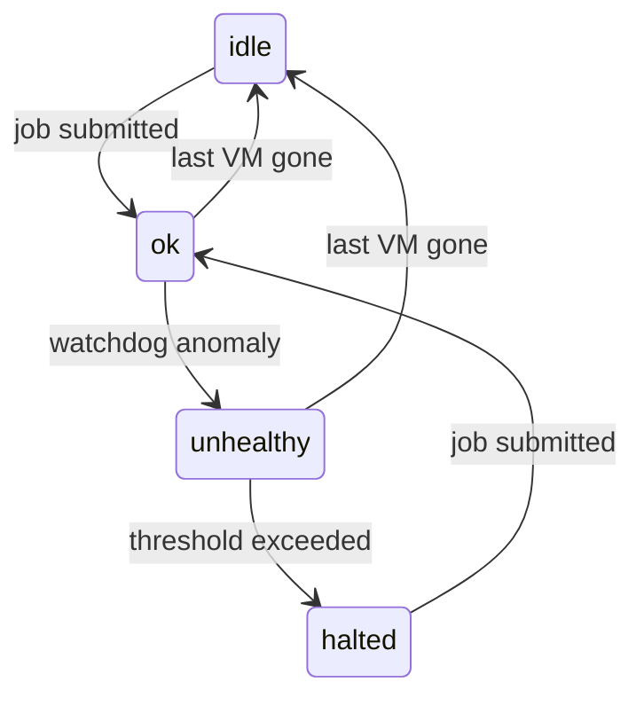

## Autoscaler

The autoscaler has two responsibilities:

1. **Provisioning** — continuously compare the number of pending tasks against the number of active workers, and
   submit BatchAPI requests to bring the worker count up to meet demand. It prefers preemptible VMs up to a
   configurable limit, then falls back to non-preemptible VMs for the remainder.

2. **Watchdog** — monitor the health of running batches and workers, detect anomalies (startup failures, zombies,
   over-provisioning, stuck jobs), take corrective action, and communicate the workpool's health status to the user.

Both responsibilities share the same `WorkPool` state and run on the same process; they are described separately
below for clarity.

---

There are several ways that things can go wrong and we want this system to proactively identify signs of
problems and adjust (or if behavior is suspicious, abort rather than burn through compute time it is billed for)

"Normal" failures:

- Worker nodes may shutdown unexpectedly (e.g. preemption)

"Unhealthy" failures:

- A batch job starts but fails to create VMs
- The VMs may fail to start the worker
- The worker may crash causing the VM to shutdown
- The worker may become non-responsive, but since it's technically still running, the VM stays running

In the event of "Normal" failures, the VM shuts down so there's no impact to billing, and we want to recover by
spawning a replacement worker.

In the event of "Unhealthy" failures, we want to shut down the affected VMs and set the `unhealthy` flag on the
BatchAPIRequest so the caller knows to take action (e.g. spawn replacement workers or alert the user).

If the number of zombie workers in a single batch exceeds `max_zombies_before_abort`, something not understood is
going on and we terminate the entire batch and mark it `failed`.

---

## WorkPool fields

### Watchdog parameters

These are properties of the `WorkPools` collection so they can be tuned per workpool:

| Field | Default | Description |
| ----- | ------- | ----------- |

**Provisioning parameters:**

| Field                             | Default | Description                                                                    |
| --------------------------------- | ------- | ------------------------------------------------------------------------------ |
| `max_worker_count`                | —       | Hard cap on total simultaneous workers for this workpool                       |
| `max_preemptible_worker_attempts` | —       | Total number of preemptible VMs to attempt before switching to non-preemptible |
| `max_workers_per_request`         | 100     | Maximum VMs to request in a single BatchAPIRequest                             |

**Watchdog parameters:**

| Field                            | Default    | Description                                                                                                 |
| -------------------------------- | ---------- | ----------------------------------------------------------------------------------------------------------- |
| `min_time_between_polls`         | 5 seconds  | Cooldown window for the leading-edge throttle; coalesces burst notifications into at most one trailing poll |
| `max_time_between_polls`         | 5 minutes  | Fallback poll interval; a poll runs regardless of notifications if this much time has elapsed               |
| `max_time_to_start_worker`       | 5 minutes  | Maximum time after a batch reaches `RUNNING` before a worker must register                                  |
| `max_time_in_queue`              | 15 minutes | Maximum time a batch may stay queued (never reaching `RUNNING`) before it is marked `failed`                |
| `vm_shutdown_grace_period`       | 1 minute   | Time allowed for a VM to finish shutting down after the worker's heartbeat expires                          |
| `max_zombies_before_abort`       | 3          | Number of zombie VMs above which the entire batch is terminated rather than surgical action                 |
| `max_consecutive_failed_batches` | 2          | Number of consecutive failed batches before provisioning is halted                                          |

### Status fields

| Field              | Type      | Description                                                                                                                           |
| ------------------ | --------- | ------------------------------------------------------------------------------------------------------------------------------------- |
| `status`           | string    | Current workpool status — see state machine below                                                                                     |
| `status_message`   | string    | Human-readable explanation of the current status; populated when status is not `ok` or `idle`                                         |
| `last_incident_at` | timestamp | Time of the most recent watchdog action; never cleared, useful for audit purposes                                                     |
| `incident_count`   | int       | Count of watchdog incidents since the last return to `ok`; lets the UI distinguish a single recovered blip from sustained degradation |

---

## WorkPool state machine

| Status      | Meaning                                                           |
| ----------- | ----------------------------------------------------------------- |
| `idle`      | No VMs running; resting state between jobs                        |
| `ok`        | VMs running, watchdog sees no problems                            |
| `unhealthy` | Watchdog detected and acted on anomalies; provisioning continues  |
| `halted`    | Provisioning suspended due to too many consecutive failed batches |

Transitions:

| From        | To          | Trigger                                                                   |
| ----------- | ----------- | ------------------------------------------------------------------------- |
| `idle`      | `ok`        | New job submitted (provisioning starts)                                   |
| `halted`    | `ok`        | New job submitted (user's signal that the configuration problem is fixed) |
| `ok`        | `unhealthy` | Watchdog detects an anomaly                                               |
| `ok`        | `idle`      | Last VM is gone; no pending tasks                                         |
| `unhealthy` | `idle`      | Last VM is gone (after batch terminated by watchdog or naturally)         |
| `unhealthy` | `halted`    | Consecutive failed batch threshold exceeded                               |

If a job is submitted when status is `ok` or `unhealthy`, the status is left unchanged.



`status_message` and `last_incident_at` are updated each time the watchdog takes action.
`status` only returns to `ok` via job submission — never automatically.

---

## BatchAPIRequest fields

| Field                     | Type      | Description                                                                                                                                               |
| ------------------------- | --------- | --------------------------------------------------------------------------------------------------------------------------------------------------------- |
| `batch_id`                | string    | Applied as a label to every VM in the batch; used to match running VMs back to the batch                                                                  |
| `job_id`                  | string    | The GCP Batch API job handle; used to query job status and to correlate inbound PubSub notifications                                                      |
| `workpool_id`             | string    | The workpool this batch belongs to                                                                                                                        |
| `expected_vm_count`       | int       | Number of VMs requested from the Batch API                                                                                                                |
| `submitted_at`            | timestamp | When the Batch API request was created                                                                                                                    |
| `running_since`           | timestamp | When the Batch API job was first observed `RUNNING`; null while `QUEUED`/`SCHEDULED`. Startup grace is measured from here, not `submitted_at`             |
| `registered_worker_count` | int       | Monotonic count of workers that have _ever_ registered for this batch. Incremented atomically at registration; never decremented (it is not a live count) |
| `preemptible`             | bool      | Whether the VMs in this batch are preemptible                                                                                                             |
| `status`                  | string    | Lifecycle — see table below                                                                                                                               |
| `unhealthy`               | bool      | Sticky flag; set whenever the watchdog acts on an anomaly. **Independent of `status`** — never cleared                                                    |

`status` lifecycle:

| Status      | Meaning                                                       |
| ----------- | ------------------------------------------------------------- |
| `pending`   | Submitted; not yet confirmed running with a registered worker |
| `started`   | At least one worker has registered; batch is running          |
| `failed`    | Batch API reported failure, or the watchdog aborted the batch |
| `completed` | Batch API reported success                                    |

`status` and `unhealthy` are orthogonal:

- A batch can be `started` **and** `unhealthy` — e.g. a zombie or a single startup-failed VM was surgically
  terminated, but the batch as a whole kept running. Such a batch does **not** count toward the halt threshold.
- A batch is marked `failed` only when the whole batch is abandoned (Batch API failure, over-provisioning,
  zombie-abort, stuck-in-queue, or no worker ever registered). Only `failed` batches count toward the halt threshold.

VMs are labeled with **both** `batch_id` and `workpool_id`, so the watchdog can list VMs scoped to a single
batch (zombie/startup checks) or to the whole workpool (the idle transition).

---

## Detection Approach

Since some unhealthy failure modes (e.g. a non-responsive worker) are indistinguishable from normal failures
using only Firestore data, the cluster reconciler periodically cross-references GCP's live VM list against Firestore state.

Workers record their GCP instance name at startup. This enables exact matching between running VMs and
Firestore Worker records, allowing surgical termination of specific problem VMs.

The watchdog is assumed to run as a **single instance**. All pollers do read-modify-write on `WorkPool.status`
and `BatchAPIRequest.status`; if the watchdog is ever run redundantly, these updates must be wrapped in
Firestore transactions to avoid races.

### Shared helper: `record_incident`

Every anomaly funnels through one helper so workpool bookkeeping stays consistent:

```
def record_incident(workpool, message):
    if workpool.status != "halted":     # a halted pool stays halted
        set workpool.status = "unhealthy"
    set workpool.status_message = message
    set workpool.last_incident_at = now
    increment workpool.incident_count
```

---

## Autoscaler Poll (runs every 1 minute)

Compares pending task demand against active worker supply and submits BatchAPIRequests to close the gap.
Preemptible VMs are preferred until the workpool's preemptible budget is exhausted, then non-preemptible
VMs are used for the remainder. A single poll may produce up to two BatchAPIRequests (one preemptible, one
non-preemptible) if the budget boundary falls within the current request.

```
for each WorkPool:
    # Skip if provisioning is suspended
    if workpool.status == "halted":
        continue

    # How many workers are needed?
    pending_tasks  = count of Tasks where workpool_id == workpool.workpool_id
                                      and status == "pending"
    active_workers = count of Workers where workpool_id == workpool.workpool_id
                                        and heartbeat_expiry > now

    target = min(workpool.max_worker_count, pending_tasks)
    needed = max(0, target - active_workers)

    if needed == 0:
        continue

    # Respect the per-request cap
    to_request = min(needed, workpool.max_workers_per_request)

    # Determine how much of the preemptible budget remains
    preemptible_attempted = sum(b.expected_vm_count
                                for b in BatchAPIRequests
                                where workpool_id == workpool.workpool_id
                                  and preemptible == true)
    remaining_preemptible = max(0, workpool.max_preemptible_worker_attempts - preemptible_attempted)

    preemptible_count     = min(to_request, remaining_preemptible)
    non_preemptible_count = to_request - preemptible_count

    if preemptible_count > 0:
        create BatchAPIRequest(preemptible=true, expected_vm_count=preemptible_count, ...)
        set workpool.status = "ok" if workpool.status == "idle"

    if non_preemptible_count > 0:
        create BatchAPIRequest(preemptible=false, expected_vm_count=non_preemptible_count, ...)
        set workpool.status = "ok" if workpool.status == "idle"
```

Note: the Provisioning Guard (`workpool.status == "halted"`) is checked at the top of the loop rather than
inside a separate function, since the autoscaler poll is the only call site for new BatchAPIRequests.

---

## Task Recovery (runs every 30s)

Handles the common preemption/crash case quickly with no GCP API calls.

```
for each Worker where heartbeat_expiry < now:
    for each Task where owning_worker_id == worker.worker_id
                    and status in (claimed, running, writing):
        reset task → pending
        clear owning_worker_id
```

---

## Cluster Reconciler (runs on Batch API notification, or after max_time_between_polls)

Reconciles Firestore state against live GCP state: VM list for zombie detection, Batch API status
for job-level lifecycle. Triggered immediately by a PubSub notification from the Batch API; falls
back to a 5-minute periodic check if no notification arrives.

```
for each WorkPool that has batches with status in ("pending", "started"):
    active_batches = BatchAPIRequests where workpool_id == workpool.workpool_id
                                        and status in ("pending", "started")

    for each batch in active_batches:
        batch_api_status = gcp.get_batch_job_status(batch.job_id)
        # one of: QUEUED, SCHEDULED, RUNNING, SUCCEEDED, FAILED

        # Stamp running_since the first time we observe the job actually running.
        if batch_api_status == RUNNING and batch.running_since is null:
            set batch.running_since = now

        if batch_api_status == FAILED:
            terminate all VMs in batch via GCP API
            set batch.status = "failed"; set batch.unhealthy = true
            record_incident(workpool, "Batch job {batch.job_id} reported failure by Batch API")
            check_halt_threshold(workpool)
            continue  # job is gone; skip VM-level checks

        if batch_api_status == SUCCEEDED:
            set batch.status = "completed"
            continue  # job finished cleanly; absence of VMs is expected

        # Job is QUEUED/SCHEDULED/RUNNING — reconcile VMs against Firestore
        gcp_vms = gcp.list_running_vms(label=batch.batch_id)
                   # dict of {instance_name → vm}

        workers  = firestore.Workers where batch_id == batch.batch_id
                   # list of {worker_id, instance_name, heartbeat_expiry}

        registered_instance_names = {w.instance_name for w in workers}

        # Anomaly 1: More VMs than requested — serious bug, abort immediately
        if len(gcp_vms) > batch.expected_vm_count:
            terminate all VMs in batch via GCP API
            set batch.status = "failed"; set batch.unhealthy = true
            record_incident(workpool, "Over-provisioning: {len(gcp_vms)} VMs running, expected {batch.expected_vm_count}")
            check_halt_threshold(workpool)
            continue

        # Anomaly 2: startup failure. Grace is measured from running_since (not submitted_at),
        # so VMs still waiting in the queue for capacity/quota are not mistaken for failures.
        if batch.running_since is set and now - batch.running_since > workpool.max_time_to_start_worker:
            if batch.registered_worker_count == 0:
                # No worker ever registered — the whole batch is a startup failure.
                # Also covers VMs that failed fast and have already disappeared (gcp_vms empty).
                terminate all VMs in batch via GCP API
                set batch.status = "failed"; set batch.unhealthy = true
                record_incident(workpool, "Batch {batch.batch_id}: no worker registered within grace period")
                check_halt_threshold(workpool)
                continue
            else:
                # Some workers registered; terminate only the specific VMs that never did.
                startup_failed_vms = gcp_vms.keys() - registered_instance_names
                for each instance_name in startup_failed_vms:
                    terminate vm via GCP API
                    set batch.unhealthy = true
                    record_incident(workpool, "VM {instance_name} failed to start a worker")

        # Anomaly 3: Workers whose heartbeat expired but VM is still running (zombie).
        # heartbeat_expiry is set to the current time on both clean shutdown and crash,
        # so vm_shutdown_grace_period applies uniformly from that point.
        zombie_workers = [
            w for w in workers
            if w.heartbeat_expiry < now - workpool.vm_shutdown_grace_period
            and w.instance_name in gcp_vms
        ]

        if len(zombie_workers) > workpool.max_zombies_before_abort:
            terminate all VMs in batch via GCP API
            set batch.status = "failed"; set batch.unhealthy = true
            record_incident(workpool, "Too many zombie workers ({len(zombie_workers)}), aborting batch")
            check_halt_threshold(workpool)
        else:
            for each zombie in zombie_workers:
                terminate zombie.instance_name via GCP API
                set batch.unhealthy = true
                record_incident(workpool, "Terminated zombie worker {zombie.worker_id} on {zombie.instance_name}")

    # Once per workpool, after all its batches are processed:
    # transition to idle if no VMs remain anywhere in the workpool.
    active_vms_for_workpool = gcp.list_running_vms(label=workpool.workpool_id)
    if len(active_vms_for_workpool) == 0 and workpool.status in ("ok", "unhealthy"):
        set workpool.status = "idle"
```

---

## Batch Startup Monitor (runs on Batch API notification, or after max_time_between_polls)

Watches newly submitted batch jobs until they are confirmed running or failed. Restricted to
`pending` batches only; once a batch transitions to `started`, `failed`, or `completed`, the batch startup monitor
stops watching it and the cluster reconciler owns steady-state health. Triggered immediately by PubSub
notifications; falls back to 30-second polling if no notification arrives.

```
for each BatchAPIRequest where status == "pending":
    workpool = fetch WorkPool for batch.workpool_id
    batch_api_status = gcp.get_batch_job_status(batch.job_id)

    if batch_api_status == RUNNING and batch.running_since is null:
        set batch.running_since = now

    if batch_api_status == FAILED:
        set batch.status = "failed"; set batch.unhealthy = true
        record_incident(workpool, "Batch job {batch.job_id} failed before any workers started")
        check_halt_threshold(workpool)
        continue

    if batch_api_status == SUCCEEDED:
        # Job completed before any worker registered — treat as failure
        set batch.status = "failed"; set batch.unhealthy = true
        record_incident(workpool, "Batch job {batch.job_id} completed with no workers registered")
        check_halt_threshold(workpool)
        continue

    # Promote to "started" as soon as any worker has registered.
    if batch.registered_worker_count >= 1:
        set batch.status = "started"
        continue  # the batch startup monitor will no longer poll this batch; the cluster reconciler takes over

    # Guard against a batch that never leaves the queue (e.g. quota/capacity exhaustion):
    # if it has never reached RUNNING within max_time_in_queue, give up on it.
    if batch.running_since is null and now - batch.submitted_at > workpool.max_time_in_queue:
        set batch.status = "failed"; set batch.unhealthy = true
        record_incident(workpool, "Batch job {batch.job_id} never left the queue within max_time_in_queue")
        check_halt_threshold(workpool)
        continue
```

Note the division of labor for an un-started batch: a job that **never reaches `RUNNING`** is caught here by
the `max_time_in_queue` guard, while a job that **reaches `RUNNING` but whose VMs never register a worker**
stays `pending` here (`running_since` is set, so neither this guard nor the `started` promotion fires) and is
caught by the cluster reconciler's Anomaly 2 after `max_time_to_start_worker`.

---

## Batch API Notifications (PubSub)

The GCP Batch API can publish PubSub notifications when a job or task changes state. The watchdog
subscribes to this topic. On receipt of a notification:

- If the notification is for a `pending` batch → trigger a batch startup monitor check for that batch
- If the notification is for a `started` batch → trigger a cluster reconciler check for that batch

### Notification scheduling — leading-edge throttle with trailing coalescing

Notifications can arrive in rapid bursts (e.g. many tasks completing at once). To avoid redundant
back-to-back polls while still reacting quickly, each poller uses a **leading-edge throttle with
trailing coalescing** per batch:

- The **first** notification triggers a poll immediately (leading edge).
- If further notifications arrive during the `min_time_between_polls` cooldown window (default 5s),
  exactly **one** additional poll is scheduled for the end of the window — no matter how many
  notifications arrive (coalescing).
- Once quiet, no further polls are triggered until the next notification or the periodic fallback.

Example for a single batch:

| Time   | Event                        | Action                                               |
| ------ | ---------------------------- | ---------------------------------------------------- |
| t=0s   | notification arrives         | poll runs immediately                                |
| t=1s   | notification arrives         | schedule trailing poll at t=0+min_time_between_polls |
| t=2s   | notification arrives         | trailing poll already queued — do nothing            |
| t=5s   | cooldown expires             | trailing poll runs                                   |
| t=305s | max_time_between_polls fires | poll runs (no notification needed)                   |

The `max_time_between_polls` fallback is the backstop for delayed or missed messages. It fires
regardless of notification activity.

---

## Halt threshold check (called by watchdog pollers whenever a batch is marked `failed`)

When the cluster reconciler or batch startup monitor sets `batch.status = "failed"`, they immediately call this check.
The `halted` transition lives here rather than in the Provisioning Guard so that `workpool.status`
is always the authoritative signal — the guard only needs to read it.

Only fully-`failed` batches count toward the threshold. A batch that is `unhealthy` but still `started`
(e.g. a few VMs were surgically terminated but the batch kept running) is deliberately **not** counted —
partial degradation is not treated as a reason to halt provisioning.

```
def check_halt_threshold(workpool):
    recent_batches = BatchAPIRequests where workpool_id == workpool.workpool_id
                                         and status in ("failed", "started", "completed")
                     order by submitted_at DESC
                     limit workpool.max_consecutive_failed_batches
                     # "pending" excluded — not yet classified

    if len(recent_batches) == workpool.max_consecutive_failed_batches
       and all(b.status == "failed" for b in recent_batches):
        set workpool.status = "halted"
        set workpool.status_message = "Last {workpool.max_consecutive_failed_batches} batches all failed — possible configuration problem"
        set workpool.last_incident_at = now
```

---

## Job submission (workpool status update)

When a new job is submitted that uses a workpool:

```
workpool = fetch WorkPool

if workpool.status in ("idle", "halted"):
    set workpool.status = "ok"
    clear workpool.status_message
    set workpool.incident_count = 0
# if status is "ok" or "unhealthy", leave it unchanged
```

Submitting to a `halted` workpool is the user's signal that they believe the configuration
problem is resolved. The watchdog will halt provisioning again if failures continue.

---

## Notes

- Task recovery orphans tasks as soon as `heartbeat_expiry < now`. The cluster reconciler waits an additional
  `vm_shutdown_grace_period` before acting on the VM. Tasks are already being retried elsewhere
  by the time the cluster reconciler terminates the stale VM.

- For Anomaly 2, there are no tasks to orphan (the VM never claimed any). Pending tasks
  remain available for healthy workers in this batch or a future batch.

- `unhealthy` on a `BatchAPIRequest` is a sticky flag — it is never cleared. It signals to
  the caller that intervention may be needed even if the batch subsequently terminates cleanly.
  It is independent of `status`: a `started` batch can be `unhealthy` after surgical termination.

- `registered_worker_count` is monotonic — incremented at registration, never decremented. It answers
  "did any worker ever register for this batch?", not "how many are alive now". Liveness comes from the
  Worker heartbeat records, not this counter.

- `workpool.status_message` reflects the most recent watchdog action. `workpool.last_incident_at` and
  `workpool.incident_count` are not cleared until the workpool returns to `ok` via job submission, so the
  UI can distinguish a single recovered incident from sustained degradation even after a return to `idle`.

---

## Things to improve

### Detection latency for the "VMs run but workers never register" mode

Most failure modes are now caught quickly:

- Batch-API-level failures (`FAILED`, zero-worker `SUCCEEDED`, stuck-in-queue) are caught by the batch startup monitor within
  ~30s, or near-instantly via a PubSub notification.
- Fast-failing VMs that disappear before the cluster reconciler runs are caught by the `registered_worker_count == 0`
  whole-batch check in Anomaly 2.

The remaining slow mode is when VMs **do** reach `RUNNING` but their worker binary never registers. Anomaly 2
must wait `max_time_to_start_worker` (5 min, measured from `running_since`) before declaring the batch failed.
With `max_consecutive_failed_batches = 2`, halting a persistently-broken configuration in this mode takes up
to ~10 minutes, wasting two batches worth of VMs. Lowering `max_time_to_start_worker` helps but has a floor set
by real worker startup time.

### Idle transition vs. a lagging Batch API status

The idle transition keys off the live VM count. If a batch's VMs all disappear while the Batch API still
reports `RUNNING`, the workpool can flip to `idle` while the batch record is still `started`; it resolves on
the next poll once the Batch API reports a terminal status. Harmless, but it means `idle` is not a guarantee
that every batch record is terminal.
