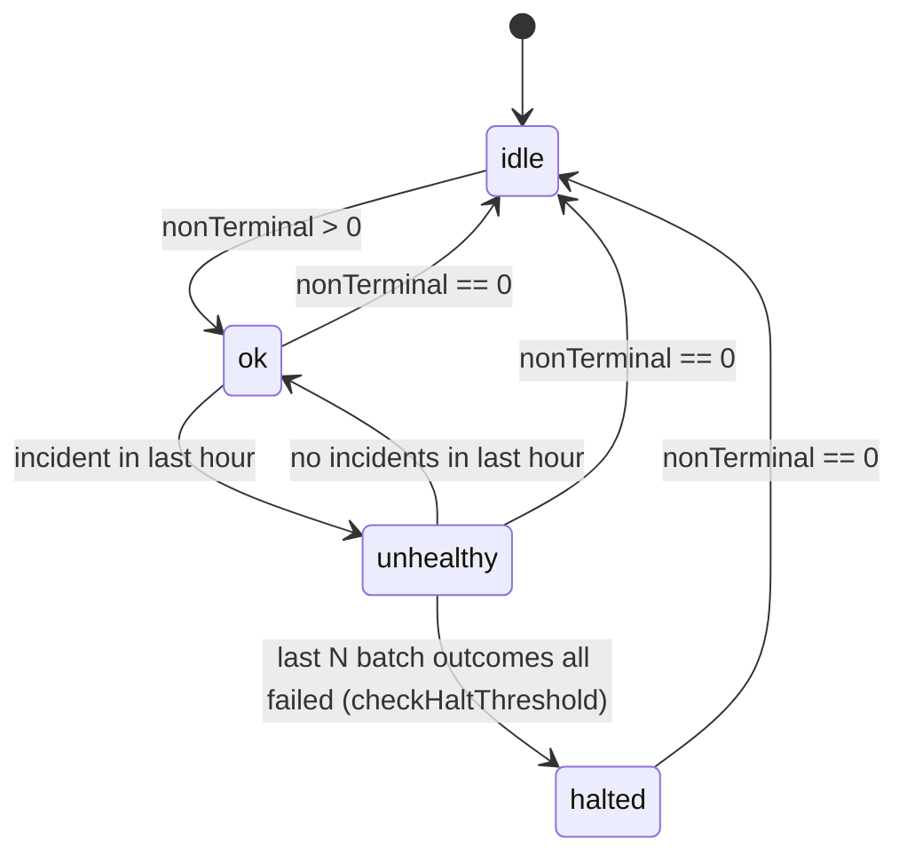
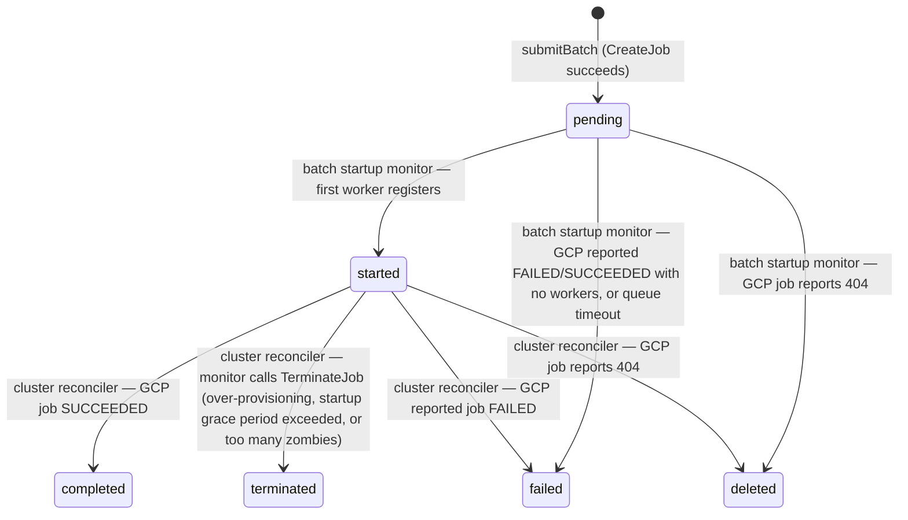
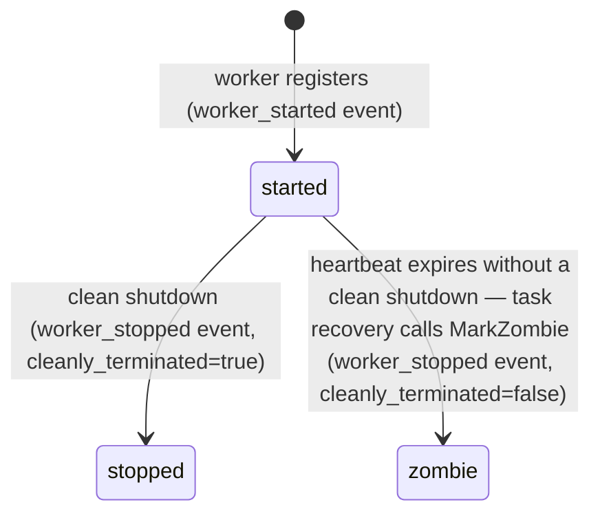

# Cluster health: workpool states and transitions

This document describes how the monitor (`v100/monitor/*.go`) currently
tracks and reports the health of a workpool's cluster of worker VMs. It
reflects the implementation as it exists today, not an aspirational design.

## The states involved

Several independent state machines are layered together. The one people
usually mean by "cluster health" is `WorkPoolStatus`, but it's derived from —
and interacts with — the others.

| State machine    | Values                                                                                             | Owner                                                                                            |
| ---------------- | -------------------------------------------------------------------------------------------------- | ------------------------------------------------------------------------------------------------ |
| `WorkPoolStatus` | `idle`, `ok`, `unhealthy`, `halted`                                                                | The monitor; stored on `WorkPoolState`/`WorkPoolSummary`                                         |
| `BatchStatus`    | `pending`, `started`, `failed`, `completed`, `deleted`                                             | The monitor; stored on `BatchAPIRequest`                                                         |
| Worker status    | `started`, `stopped`, `zombie`                                                                     | The worker process itself (`started`/`stopped`), or task recovery on heartbeat expiry (`zombie`) |
| Task status      | `pending`, `claimed`, `running`, `writing`, plus terminal (`success`, `error`, `failed`, `killed`) | Workers, as tasks execute                                                                        |

`WorkPoolStatus` is the one surfaced most prominently (dashboard, `sparkles dev submit`'s polling loop) and the one this document focuses on.

### `WorkPoolStatus`

Decided entirely by the WorkPool summary poll, except for `→ halted` (see
"`unhealthy` → `halted`: the halt threshold" below):



`nonTerminal == 0` (no non-`stopped` workers, no non-terminal tasks) always
wins and sends any state to `idle` — including `halted`, which is otherwise
sticky. `halted` has no other way out.

### `BatchStatus`



The batch startup monitor owns `pending`; the cluster reconciler owns `started`. A synchronous `CreateJob`
failure in `submitBatch` never reaches `pending` at all — no `BatchAPIRequest`
document is created for it (see "Batch outcome events" below).

`failed` and `terminated` are deliberately distinct: `failed` means GCP
itself reported the job as failed; `terminated` means the monitor's own
bookkeeping (VM counts, worker registrations, heartbeats) found an anomaly
and killed an otherwise-live job. `pending → failed` doesn't split the same
way — none of the batch startup monitor's three failure checks call
`TerminateJob` (the GCP job is already failed/succeeded/still-queued in each
case), so there's no monitor-initiated termination to distinguish at that
stage. See "`BatchStatus` lifecycle" below for the call sites, and
`BatchAPIRequest.TerminationReason` for the human-readable reason recorded
alongside `terminated`.

### Worker status



`zombie` and `stopped` are deliberately distinct: `stopped` means the
worker shut down cleanly (it wrote its own status); `zombie` means task
recovery found a heartbeat that expired without one — the worker crashed,
was preempted, or otherwise stopped responding. Either transition publishes
a `worker_stopped` event, distinguished by its `cleanly_terminated` field;
task recovery also publishes a `workpool_incident` event when it marks a
worker a zombie. This is a different, `Worker.status`-level concept from the
cluster reconciler's zombie _VM_ check (Anomaly 3 in the `BatchStatus`
section below), which cross-references heartbeat expiry against whether the
VM is still running in GCP, independent of this field.

### Task status

```mermaid
stateDiagram-v2
    [*] --> pending
    pending --> claimed: a worker claims the task
    claimed --> running: worker starts the container
    running --> writing: container exits; uploading results/logs
    writing --> success: upload complete, exit code 0
    writing --> error: upload complete, non-zero exit code
    claimed --> failed: infrastructure failure
    running --> failed: infrastructure failure
    writing --> failed: infrastructure failure
    claimed --> killed: administrative kill
    running --> killed: administrative kill
    writing --> killed: administrative kill
    claimed --> pending: owning worker's heartbeat expires (task recovery orphan recovery)
    running --> pending: owning worker's heartbeat expires (task recovery orphan recovery)
    writing --> pending: owning worker's heartbeat expires (task recovery orphan recovery)
```



`claimed`/`running`/`writing` are the "active" statuses (`activeStatuses` in
`task_queue.go`) that task recovery resets back to `pending` when their owning
worker's heartbeat expires, so another worker can pick the task back up.

## The pollers that drive all of this

The monitor runs several independent, debounced pollers
(`RunMonitorLoop`, `v100/monitor/monitor.go:127`), each on its own
notification-or-timer schedule (2s minimum, 30s fallback, except where
noted):

| Poller                | File                                     | Scope                                                       | Wakes on                                                     |
| --------------------- | ---------------------------------------- | ----------------------------------------------------------- | ------------------------------------------------------------ |
| Task recovery         | `monitor.go` (`runRequeueOrphanedTasks`) | all workpools                                               | fixed timer only                                             |
| Cluster reconciler    | `cluster_reconciler.go`                  | batches in `pending`/`started`                              | PubSub notification for a started batch; timer fallback      |
| Batch startup monitor | `batch_startup_monitor.go`               | batches in `pending`                                        | PubSub notification for a pending batch; timer fallback      |
| Provisioning poll     | `provision.go`                           | workpools not `idle`/`halted`                               | `job_created`/`workpool_state_change` events; timer fallback |
| Job summary poll      | (job summary machinery)                  | non-terminal jobs                                           | `job_created`/`task_state_update` events; timer fallback     |
| WorkPool summary poll | `workpool_summary_poll.go`               | non-idle workpools, or idle ones with a fresh `job_created` | batch/job events; timer fallback                             |
| Expiry cleaner        | `monitor.go`                             | all expired documents                                       | fixed 30-minute timer                                        |

The cluster reconciler and batch startup monitor do **not** filter by `WorkPoolStatus` — they keep reconciling
batches (terminating zombie VMs, detecting GCP-reported failures, etc.) for
a workpool regardless of whether it's `ok`, `unhealthy`, or `halted`, as long
as it still has batches in `pending`/`started`. Only the **provisioning
poll** checks `WorkPoolStatus`, and only to decide whether to submit _new_
batches (`provision.go:37`, `:58`).

## `WorkPoolStatus` states

- **`idle`** — no pending tasks, no non-terminal workers. The default/rest
  state.
- **`ok`** — actively running work, no known problems.
- **`unhealthy`** — actively running work, but the watchdog has recorded at
  least one incident (a batch or worker anomaly) recently. This is a soft,
  self-healing warning state, not a hard stop — see below.
- **`halted`** — the monitor has stopped submitting new batches for this
  workpool. This is the one hard-stop state.

### `idle` ↔ `ok`

Driven entirely by the WorkPool summary poll (`workpool_summary_poll.go:60`),
based on counting non-terminal workers (status ≠ `stopped`) and non-terminal
tasks (status not in `success`/`error`/`failed`/`killed`):

- `nonTerminal == 0` → state becomes `idle` (from any state — see the
  `halted`/`unhealthy` interaction note below).
- `nonTerminal > 0` and current state is `idle` → state becomes `ok`.
- A `job_created` event on an `idle` workpool forces a summary recompute
  even though the workpool is otherwise excluded from the "active" poll set,
  so a freshly-submitted job promptly flips `idle` → `ok`
  (`workpool_summary_poll.go:41`).

### `ok`/`idle` → `unhealthy`

`recordIncident` (`monitor.go:343`) is called from task recovery
(`requeue_orphaned.go`), the cluster reconciler (`cluster_reconciler.go`),
and the batch startup monitor (`batch_startup_monitor.go`) whenever they
detect an anomaly:

- A worker's heartbeat expires without a clean shutdown — task recovery
  marks it `zombie` (`requeue_orphaned.go`; see "Worker status" above).
- A batch fails outright (see `markBatchFailed`/`markBatchTerminated` below).
- A subset of VMs fail to register a worker within the grace period, while
  others in the same batch succeed (`cluster_reconciler.go`, "Some workers
  registered; surgically terminate the VMs that never did").
- A zombie VM (heartbeat expired, VM still running per GCP) is terminated,
  below the abort threshold (`cluster_reconciler.go`, per-zombie loop).

`recordIncident` is now purely a log-to-Events operation — it publishes a
`workpool_incident` event carrying a human-readable message and does **not**
touch `WorkPoolState` at all. The `→ unhealthy` transition itself is decided
by the WorkPool summary poll instead, alongside the `idle ↔ ok` logic above
(see the next section) — deliberately centralizing all of the "what's our
current banner state" logic in one poller rather than having the watchdog pollers mutate
state directly at incident time.

This is safe to defer to the next poll tick because `unhealthy` doesn't gate
any control-flow decision (unlike `halted` — see `provision.go:37`, which
only skips `idle`/`halted` workpools). The summary poll is woken by the same
batch notifications that cause incidents in the first place, so in practice
the lag is negligible.

### `idle` ↔ `ok` ↔ `unhealthy`: all one decision, in one poller

The WorkPool summary poll (`updateWorkPoolSummary`,
`workpool_summary_poll.go:61`) computes the banner state from three pieces of
data gathered fresh on every poll — it does not carry any of this as
persisted mutable state on `WorkPoolState` (which only ever holds the bare
`State` enum):

1. `nonTerminal` — count of non-`stopped` workers plus non-terminal tasks.
2. The current `State`, to detect (and preserve) `halted`.
3. `incidentCount` — the number of `workpool_incident` events for this
   workpool in the last hour (`defaultHaltCheckWindow`), fetched via
   `EventStore.ListRecentWorkpoolIncidents`.

The decision, in priority order:

```go
switch {
case nonTerminal == 0:
    newState = idle       // regardless of prior state, including halted
case oldState == halted:
    newState = halted     // sticky; only nonTerminal==0 clears it
case incidentCount > 0:
    newState = unhealthy
default:
    newState = ok
}
```

Because `incidentCount` comes from the same windowed query used for the
`WorkPoolSummary.state_message`/`last_incident_at`/`incident_count` fields
shown on the dashboard, the banner state and those detail fields can never
disagree: a workpool showing `unhealthy` always has a matching recent
incident to point to, and it reverts to `ok` exactly when the last incident
ages out of the one-hour window — not on a one-shot, potentially-stale
timer. `saveState`'s `workpool_state_change` event message is passed
explicitly at the point of transition (only non-empty when transitioning to
`unhealthy` or `halted`), since `WorkPoolState` has no `StateMessage` field
to read it from.

See `datamodel.md`'s `Events` section for the `workpool_incident` event
schema. Halting is **not** itself published as a `workpool_incident` — only
via `workpool_state_change` — so it doesn't count toward the incident tally
above; that event type is reserved for the anomalies that lead up to a halt.

### `unhealthy` → `halted`: the halt threshold

Unlike the `→ unhealthy` transition, `→ halted` stays synchronous —
deliberately not moved into the periodic summary poll, since `halted` gates
provisioning and delaying it would let more broken batches through before
provisioning actually stops. `checkHaltThreshold` (`monitor.go:376`) is
called at the end of every full
batch failure (via `markBatchFailed`, see below) and via `submitBatch` — it
inspects the most recent batch **outcomes** (not raw `BatchAPIRequest`
records — see "Batch outcome events" below) for the workpool within the last
hour (`defaultHaltCheckWindow`). If the most recent
`WorkPool.MaxConsecutiveFailedBatches` (default 2) outcomes in that window
are _all_ failures, the workpool transitions to `halted`, with a message
like "Last 2 batches all failed within the last hour — possible
configuration problem" passed to `saveState` (and hence into the
`workpool_state_change` event) — not persisted on `WorkPoolState` itself.

### `halted` is a one-way, sticky terminal state

Nothing in the current implementation ever transitions a workpool back out
of `halted` automatically:

- The WorkPool summary poll's state-decision switch explicitly preserves
  `halted` over any `incidentCount > 0` result (see above) — `recordIncident`
  itself no longer touches `WorkPoolState`, so it can't overwrite `halted`
  either way.
- The WorkPool summary poll explicitly leaves `halted` alone even once
  `nonTerminal` drops to... actually it _does_ clear to `idle` once
  `nonTerminal == 0` (that branch isn't conditioned on the old state) — so a
  halted workpool that fully drains its tasks/workers will show as `idle`.
  But as long as it still has non-terminal work, it stays `halted` forever.
- The provisioning poll refuses to submit any new batches for a `halted`
  workpool, indefinitely (`provision.go:58`).

In practice, getting out of `halted` today means either manual Firestore
intervention or submitting a corrected workpool config under a new
workpool ID (workpool IDs are content-hashed from the spec by default, so a
genuinely fixed config naturally gets a fresh ID and a fresh `WorkPoolState`
— see `resolveWorkpoolID` in `v100/dev/submit.go`).

## `BatchStatus` lifecycle

A `BatchAPIRequest` document is created in `submitBatch` (`provision.go:120`)
after a successful call to the GCP Batch API's `CreateJob`, starting in
`pending`. From there:

- The **batch startup monitor** owns `pending` batches. It promotes a batch to `started` the
  first time a worker registers (`RegisteredWorkerCount >= 1`), or to
  `failed` if it fails/completes with zero workers registered, or if it
  never leaves the queue within `max_time_in_queue`. None of these three
  checks call `TerminateJob`, so they always land on `failed`, never
  `terminated`.
- The **cluster reconciler** owns `started` batches. It promotes to
  `completed` on GCP-reported success, to `failed` on GCP-reported failure
  (`reconcileBatch`), or to `terminated` — via its own `TerminateJob` call —
  on over-provisioning, no worker registering within the startup grace
  period, or too many zombie workers (all three in `reconcileVMs`).
- Either poller can mark a batch `deleted` if the GCP Batch API reports 404 for
  its job (manually deleted or expired).

Whenever a batch is marked done in full (as opposed to a partial,
batch-continues incident — see above), the code goes through `markBatchDone`
(`monitor.go:374`) via one of two thin wrappers: `markBatchFailed`
(`monitor.go:355`, for the GCP-reported case) or `markBatchTerminated`
(`monitor.go:365`, for the monitor-initiated case, which also sets
`BatchAPIRequest.TerminationReason` to the same message). Either way,
`markBatchDone` sets `Status`/`Unhealthy = true` on the batch, saves it,
calls `recordIncident` (logs to Events only) and `PublishBatchFailed` (the
same event type for both — `checkHaltThreshold` treats `failed` and
`terminated` identically, since both mean "this batch didn't work out"),
and calls `checkHaltThreshold`.

## Batch outcome events (`batch_failed` / `batch_succeeded`)

`checkHaltThreshold` reads from the `Events` Firestore collection rather
than from `BatchAPIRequest` documents directly. This matters for one
specific case: if the GCP Batch API's `CreateJob` call itself fails
synchronously (e.g. an invalid job name), `submitBatch` never creates a
`BatchAPIRequest` at all — there's no batch to mark failed. That failure is
still published as a `batch_failed` event directly (with the API's error as
the reason), so it's counted toward the halt threshold even though no batch
document ever existed for it. `batch_succeeded` is published once per batch,
the first time it's confirmed to have a registered worker (the same
`pending → started` transition the batch startup monitor uses).

See `datamodel.md`'s `Events` section and `batch-success-failure-events.md`
for the full design rationale.

## Known asymmetries (as of this writing)

Two places don't fully reflect the batch-outcome-events change above yet:

1. **`submitBatch`'s synchronous `CreateJob` failure doesn't call
   `recordIncident`** the way `markBatchFailed` does for every other failure
   path — it only publishes the `batch_failed` event (for `checkHaltThreshold`),
   not a `workpool_incident` event (for the summary poll's `incidentCount`
   check). So a workpool can accumulate `MaxConsecutiveFailedBatches - 1`
   silent `CreateJob` failures with `WorkPoolStatus` still showing `ok` the
   whole time, then jump straight to `halted` on the next one, with no
   intermediate `unhealthy` warning.
2. **`WorkPoolSummary.UnhealthyBatchCount`/`BatchAPIRequestCounts`** (surfaced
   via the dashboard) are computed purely from `BatchAPIRequest` documents
   (`workpool_summary_poll.go:70-92`). Since a `CreateJob` failure never
   produces one, these dashboard-facing counts don't reflect it at all, even
   though it's now visible in the `Events` log and does count toward halting.

## Future work

### Base `ok → unhealthy` on recent `batch_failed` counts instead of any incident

Today, the WorkPool summary poll flips to `unhealthy` the moment
`incidentCount > 0` — i.e. **any** `workpool_incident` event in the last
hour, including partial incidents that don't fail a whole batch (a subset
of VMs failing to register, a single zombie worker being terminated; see
"Some workers registered; surgically terminate the VMs that never did" and
the per-zombie loop above). That makes `unhealthy` a fairly sensitive,
somewhat noisy signal — one terminated zombie VM in an otherwise healthy
fleet is enough to flip the whole workpool's banner state.

An alternative worth considering: base `ok → unhealthy` on counting recent
`batch_failed` events instead — "too many batch failures in the last hour" —
using the same `EventStore.ListRecentBatchOutcomes` query
`checkHaltThreshold` already uses for the halt decision. Yes, this is
directly queryable from the `Events` log today; no new event type or query
shape is needed, just a second consumer of the existing query:

- Add a threshold (e.g. `MaxRecentFailedBatches`) distinct from
  `MaxConsecutiveFailedBatches`, presumably smaller — `unhealthy` would act
  as an earlier warning on the way to `halted`, not a separate signal.
- Compute `failedCount` from `ListRecentBatchOutcomes` over the same
  `defaultHaltCheckWindow`.
- `ok → unhealthy` when `failedCount >= MaxRecentFailedBatches`, replacing
  the `incidentCount > 0` check in `updateWorkPoolSummary`.

Trade-offs to weigh before doing this:

- **Pro**: `unhealthy` and `halted` would become two thresholds over the
  exact same signal (batch outcomes) rather than two independent signals
  (`workpool_incident` vs. `batch_failed`) that can currently disagree. This
  would also close "Known asymmetries" item 1 above for free: `submitBatch`'s
  `CreateJob` failure already publishes `batch_failed` (just not
  `workpool_incident`), so it would start counting toward `unhealthy` too,
  not just toward `halted`.
- **Con**: loses direct visibility into partial incidents (VM startup
  failures below the whole-batch-failure threshold, zombie terminations) as
  a driver of the banner `WorkPoolStatus`. Those would still show up in the
  `Events` log and still populate `WorkPoolSummary`'s
  `IncidentCount`/`StateMessage` (still published by `recordIncident`) — they'd
  just no longer flip the state itself. Whether that's an acceptable loss
  depends on whether operators currently rely on the banner state for those
  partial cases, versus only reading the incident detail fields.
