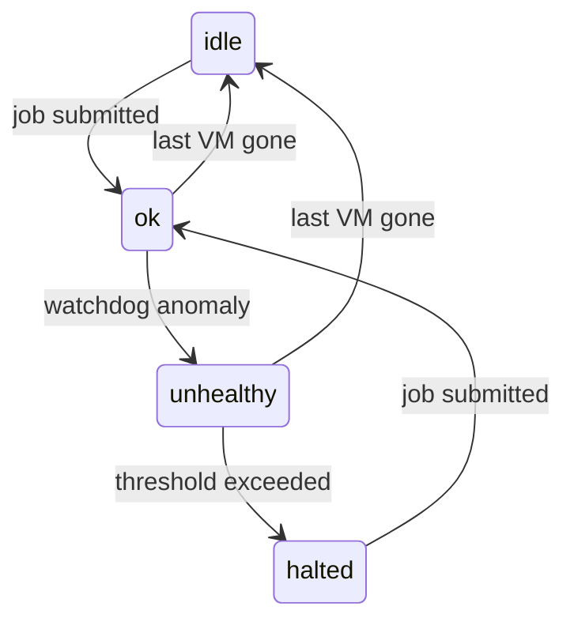

There are several ways that things can go wrong and we want this system to proactively identify signs of
problems and adjust (or if behavior is suspicious, abort rather than burn through compute time it is billed for)

"Normal" failures:

- Worker nodes may shutdown unexpectedly (e.g. preemption)

"Unhealthy" failures:

- A batch job starts but fails to create VMs
- The VMs may fail to start the worker
- The worker may crash causing the VM to shutdown
- The worker may become non-responsive, but since it's technically still running, the VM stays running

In the event of "Normal" failures, the VM shuts down so there's no impact to billing, and we want to recover by
spawning a replacement worker.

In the event of "Unhealthy" failures, we want to shut down the affected VMs and mark the BatchAPIRequest as
unhealthy so the caller knows to take action (e.g. spawn replacement workers or alert the user).

If the number of unhealthy failures exceeds `max_zombies_before_abort`, something not understood is going on and
we terminate the entire batch and mark it as unhealthy.

---

## WorkPool fields

### Watchdog parameters

These are properties of the `WorkPools` collection so they can be tuned per workpool:

| Field                            | Default   | Description                                                                                 |
| -------------------------------- | --------- | ------------------------------------------------------------------------------------------- |
| `max_time_to_start_worker`       | 5 minutes | Maximum time allowed between a BatchAPIRequest being submitted and a worker registering     |
| `vm_shutdown_grace_period`       | 1 minute  | Time allowed for a VM to finish shutting down after the worker's heartbeat expires          |
| `max_zombies_before_abort`       | 3         | Number of zombie VMs above which the entire batch is terminated rather than surgical action |
| `max_consecutive_failed_batches` | 2         | Number of consecutive batches with startup failures before provisioning is halted           |

### Status fields

| Field              | Type      | Description                                                                                   |
| ------------------ | --------- | --------------------------------------------------------------------------------------------- |
| `status`           | string    | Current workpool status — see state machine below                                             |
| `status_message`   | string    | Human-readable explanation of the current status; populated when status is not `ok` or `idle` |
| `last_incident_at` | timestamp | Time of the most recent watchdog action; never cleared, useful for audit purposes             |

---

## WorkPool state machine

| Status      | Meaning                                                           |
| ----------- | ----------------------------------------------------------------- |
| `idle`      | No VMs running; resting state between jobs                        |
| `ok`        | VMs running, watchdog sees no problems                            |
| `unhealthy` | Watchdog detected and acted on anomalies; provisioning continues  |
| `halted`    | Provisioning suspended due to too many consecutive failed batches |

Transitions:

| From        | To          | Trigger                                                                   |
| ----------- | ----------- | ------------------------------------------------------------------------- |
| `idle`      | `ok`        | New job submitted (provisioning starts)                                   |
| `halted`    | `ok`        | New job submitted (user's signal that the configuration problem is fixed) |
| `ok`        | `unhealthy` | Watchdog detects an anomaly                                               |
| `ok`        | `idle`      | Last VM is gone; no pending tasks                                         |
| `unhealthy` | `idle`      | Last VM is gone (after batch terminated by watchdog or naturally)         |
| `unhealthy` | `halted`    | Consecutive failed batch threshold exceeded                               |

If a job is submitted when status is `ok` or `unhealthy`, the status is left unchanged.



`status_message` and `last_incident_at` are updated each time the watchdog takes action.
`status` only returns to `ok` via job submission — never automatically.

---

## Detection Approach

Since some unhealthy failure modes (e.g. a non-responsive worker) are indistinguishable from normal failures
using only Firestore data, Tier 2 periodically cross-references GCP's live VM list against Firestore state.

Workers record their GCP instance name at startup. This enables exact matching between running VMs and
Firestore Worker records, allowing surgical termination of specific problem VMs.

---

## Tier 1 — Firestore only (runs frequently, e.g. every 60s)

Handles the common preemption/crash case quickly with no GCP API calls.

```
for each Worker where heartbeat_expiry < now:
    for each Task where owning_worker_id == worker.worker_id
                    and status in (claimed, running, writing):
        reset task → pending
        clear owning_worker_id
```

---

## Tier 2 — Firestore + GCP API (runs less frequently, e.g. every 5min)

```
for each BatchAPIRequest where status == active:
    workpool = fetch WorkPool for batch.workpool_id

    gcp_vms = gcp.list_running_vms(label=batch.batch_id)
               # dict of {instance_name → vm}

    workers  = firestore.Workers where batch_id == batch.batch_id
               # list of {worker_id, instance_name, heartbeat_expiry}

    registered_instance_names = {w.instance_name for w in workers}

    # Anomaly 1: More VMs than requested — serious bug, abort immediately
    if len(gcp_vms) > batch.expected_vm_count:
        terminate all VMs in batch via GCP API
        mark BatchAPIRequest as terminated + unhealthy
        set workpool.status = "unhealthy"
        set workpool.status_message = "Over-provisioning: {len(gcp_vms)} VMs running, expected {batch.expected_vm_count}"
        set workpool.last_incident_at = now
        continue

    # Anomaly 2: VMs that never registered a worker (startup failure)
    # Only checked after max_time_to_start_worker grace period
    if now - batch.submitted_at > workpool.max_time_to_start_worker:
        startup_failed_vms = gcp_vms.keys() - registered_instance_names
        for each instance_name in startup_failed_vms:
            terminate vm via GCP API
            mark BatchAPIRequest as unhealthy
            set workpool.status = "unhealthy"
            set workpool.status_message = "VM {instance_name} failed to start a worker"
            set workpool.last_incident_at = now

    # Anomaly 3: Workers whose heartbeat expired but VM is still running (zombie)
    # heartbeat_expiry is set to the current time on both clean shutdown and crash,
    # so vm_shutdown_grace_period applies uniformly from that point.
    zombie_workers = [
        w for w in workers
        if w.heartbeat_expiry < now - workpool.vm_shutdown_grace_period
        and w.instance_name in gcp_vms
    ]

    if len(zombie_workers) > workpool.max_zombies_before_abort:
        terminate all VMs in batch via GCP API
        mark BatchAPIRequest as terminated + unhealthy
        set workpool.status = "unhealthy"
        set workpool.status_message = "Too many zombie workers ({len(zombie_workers)}), aborting batch"
        set workpool.last_incident_at = now
    else:
        for each zombie in zombie_workers:
            terminate zombie.instance_name via GCP API
            mark BatchAPIRequest as unhealthy
            set workpool.status = "unhealthy"
            set workpool.status_message = "Terminated zombie worker {zombie.worker_id} on {zombie.instance_name}"
            set workpool.last_incident_at = now

    # Transition to idle if no VMs remain across all active batches for this workpool
    active_vms_for_workpool = gcp.list_running_vms(label=workpool.workpool_id)
    if len(active_vms_for_workpool) == 0:
        mark BatchAPIRequest as terminated
        if workpool.status in ("ok", "unhealthy"):
            set workpool.status = "idle"
```

---

## Provisioning Guard (runs before creating a new BatchAPIRequest)

Before requesting new VMs for a workpool, check whether recent batches have been healthy.
This prevents an infinite loop where a configuration problem causes VMs to fail repeatedly.

```
workpool = fetch WorkPool

if workpool.status == "halted":
    do not provision
    return

recent_batches = last workpool.max_consecutive_failed_batches BatchAPIRequests for workpool,
                 where submitted_at is old enough that workpool.max_time_to_start_worker has elapsed
                 (i.e. we have enough information to judge whether the batch succeeded)

if len(recent_batches) == workpool.max_consecutive_failed_batches
   and all(b.unhealthy for b in recent_batches):
    set workpool.status = "halted"
    set workpool.status_message = "Last {workpool.max_consecutive_failed_batches} batches all had startup failures — possible configuration problem"
    set workpool.last_incident_at = now
    return

# Proceed with provisioning
create new BatchAPIRequest
```

---

## Job submission (workpool status update)

When a new job is submitted that uses a workpool:

```
workpool = fetch WorkPool

if workpool.status in ("idle", "halted"):
    set workpool.status = "ok"
    clear workpool.status_message
# if status is "ok" or "unhealthy", leave it unchanged
```

Submitting to a `halted` workpool is the user's signal that they believe the configuration
problem is resolved. The watchdog will halt provisioning again if failures continue.

---

## Notes

- Tier 1 orphans tasks as soon as `heartbeat_expiry < now`. Tier 2 waits an additional
  `vm_shutdown_grace_period` before acting on the VM. Tasks are already being retried elsewhere
  by the time Tier 2 terminates the stale VM.

- For Anomaly 2, there are no tasks to orphan (the VM never claimed any). Pending tasks
  remain available for healthy workers in this batch or a future batch.

- `unhealthy` on a `BatchAPIRequest` is a sticky flag — it is never cleared. It signals to
  the caller that intervention may be needed even if the batch subsequently terminates cleanly.

- `workpool.status_message` reflects the most recent watchdog action. `workpool.last_incident_at`
  is never cleared, so the user can always tell when the last problem occurred even after
  the workpool has returned to `idle` or `ok`.
