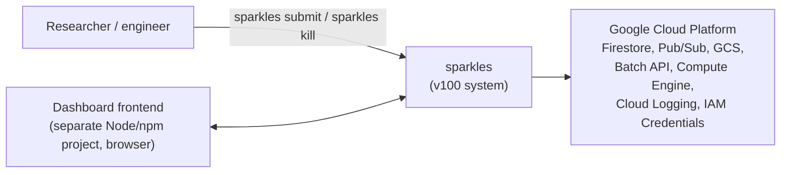

# 3. Context and Scope

## 3.1 Business Context

External actors / systems:

| Actor                      | Interaction                                                                                                                                           |
| -------------------------- | ----------------------------------------------------------------------------------------------------------------------------------------------------- |
| **End user**               | Runs `sparkles submit` / `sparkles kill` CLI; authenticates to the dashboard-backend via `SPARKLES_API_KEY`.                                          |
| **Dashboard frontend**     | Separate project; consumes the dashboard-backend's REST API (`openapi.yaml`) for job/task/workpool/worker status and log streaming; not part of v100. |
| **GCP Batch API**          | Creates/monitors VM "jobs" that run the worker binary.                                                                                                |
| **GCP Compute Engine API** | Lists/terminates individual worker VMs during anomaly handling.                                                                                       |
| **Cloud Firestore**        | System of record for all application state.                                                                                                           |
| **Cloud Pub/Sub**          | Event bus for lifecycle events, worker control messages, and Batch API notifications.                                                                 |
| **Cloud Storage (GCS)**    | Task input/output file transfer; hosts the worker binary for VM bootstrap.                                                                            |
| **Cloud Logging**          | Batch job logs (`LogsPolicy: CLOUD_LOGGING`).                                                                                                         |
| **IAM Credentials API**    | Mints short-lived tokens for a Pub/Sub "subscriber" service account used by the dashboard-backend's browser-facing subscription endpoint.             |

## 3.2 Technical Context

Three roles are all built from the same `sparkles` binary:

| Process                                         | Started by             | Talks to                                                                                                                                                                                          |
| ----------------------------------------------- | ---------------------- | ------------------------------------------------------------------------------------------------------------------------------------------------------------------------------------------------- |
| **CLI client** (`submit`, `kill`)               | End user, ad hoc       | Dashboard-backend HTTP API (`submit`); Firestore + Pub/Sub directly (`kill`)                                                                                                                      |
| **Worker** (`worker`)                           | GCP Batch, one per VM  | Firestore (claim/update tasks, register itself), GCS (file transfer), Pub/Sub (`sparkles-events` publish, per-worker control subscription), Docker daemon on the VM host, Compute metadata server |
| **Monitor** (`monitor`)                         | Operator, long-running | Firestore (all collections), Pub/Sub (`sparkles-events`, `batch-api-notifications` subscribe), GCP Batch API, Compute Engine API, Cloud Logging API                                               |
| **Dashboard-backend** (`dev dashboard-backend`) | Operator, long-running | Firestore (read/write Jobs/Tasks on submit), Pub/Sub (publish `job_created`, browser-facing subscription helper), IAM Credentials API                                                             |

Scope of this documentation: the `v100/` Go module. The `dashboard`
frontend and the legacy Python implementation at the repository root are
out of scope, treated as external systems.
